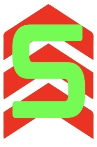

# SUP (Saturation-Up)



A website designed to scorch your eyes by oversaturating any given color 🎨 🔥

## Repository Details 

| Specification | Quantity/Info |
| ------------- | ------------- |
| License | MIT |
| Branches | 1 |
| Code of Conduct? | Yes |

## Access

Find the SUP repository on GitHub and click the link on the right. Type "./script.sh" in the terminal and open the website. Input the RGB data of any color. When you submit your color, you should see your input color in a box on the left and an oversaturated version of that color in the website background.

## The JS Color Engine

### The HSL Function

Once the user's RGB input values are extracted from the input boxes, the input color is displayed in the small box on the left. What happens next is a very complex process riddled with math and logic, so try to keep up lol.

The R, G, and B values are divided by 255 individually to yield R', G', and B'
Then, the max and min numbers are obtained out of the set of three values (R', G', B')
The difference of max and min is also stored as a separate variable (*diff*)

To get lightness, the program takes the average of max and min as a percentage

Depending on the variable *diff*, the program can go two ways
1. If *diff* is 0, then hue and saturation are also 0
2. If *diff* is not 0, the program activates the function *high_diff()*

### The high_diff Function

Under this function, saturation is automatically set to 100 for maximum eye torture (aka the entire point of this website)

Calculating hue:
1. If *max* is equal to R', then hue is defined by this equation:
```js
hue = 60 * (((Gp - Bp)/diff) % 6)
```
2. If *max* is equal to G', then hue is defined by this equation:
```js
hue = 60 * (((Bp - Rp)/diff) + 2)
```
3. If *max* is equal to B', then hue is defined by this equation:
```js
hue = 60 * (((Rp - Gp)/diff) + 4)
```

Once the hue has been determined, the hue, saturation, and lightness are combined into an hsl format which is then used to display the oversaturated color in the website background.

## Logo

